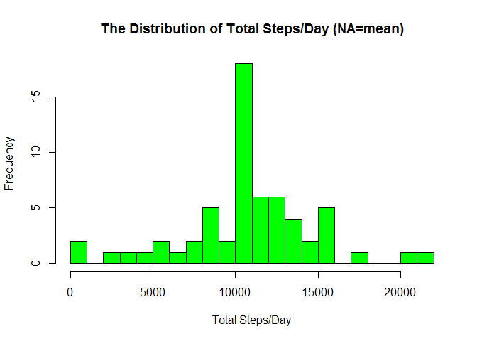
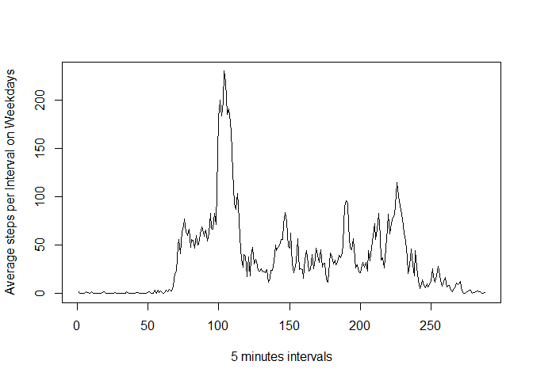
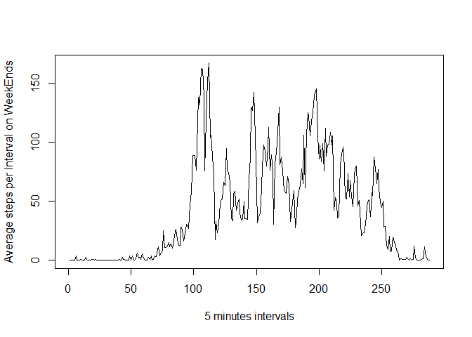

#Reproducible Research : Assignment1 

This assignment makes use of data from a personal activity monitoring device. This device collects data at 5 minute intervals through out the day. The data consists of two months of data from an anonymous individual collected during the months of October and November, 2012 and include the number of steps taken in 5 minute intervals each day.

The data for this assignment can be downloaded from the course web site:

    Dataset: Activity monitoring data [52K]

    The variables included in this dataset are:

    steps: Number of steps taking in a 5-minute interval (missing values are coded as NA)
    date: The date on which the measurement was taken in YYYY-MM-DD format
    interval: Identifier for the 5-minute interval in which measurement was taken

    The dataset is stored in a comma-separated-value (CSV) file and there are a total of 17,568 observations in this dataset.

##loading library


```r
library(ggplot2)
library(knitr)
```

```
## Warning: package 'knitr' was built under R version 3.2.3
```

```r
library(timeDate)
```

```
## Warning: package 'timeDate' was built under R version 3.2.3
```


#### Reading Data


```r
##Assuming the raw dataset(.zip) downloaded into the working directory
unzip("repdata_data_activity.zip", overwrite = T)

##Reading data
datasource <- read.csv ('activity.csv', header = TRUE, sep = ",",
                colClasses=c("numeric", "character", "numeric"))
```


#### Preprocessing - Formating date(as date) and interval (as factor)


```r
datasource$date <- as.Date(datasource$date, format = "%Y-%m-%d")
datasource$interval <- as.factor(datasource$interval)
```

#### Accumulating total step/day and creating day vs step_perday table


```r
steps_perday <- aggregate(steps ~ date, datasource, sum)
colnames(steps_perday) <- c("date","steps")
head(steps_perday)
```

```
##         date steps
## 1 2012-10-02   126
## 2 2012-10-03 11352
## 3 2012-10-04 12116
## 4 2012-10-05 13294
## 5 2012-10-06 15420
## 6 2012-10-07 11015
```


#### Drawing Histogram for total steps/day

```r
hist(x=steps_perday$steps ,col="green",breaks=20,xlab="Total Steps/Day",
     ylab="Frequency",
     main="The Distribution of Total Steps/Day")
```

<!-- -->

####MEan and Median


```r
##CALCULATING mean
mean (steps_perday$steps, na.rm=TRUE)
```

```
## [1] 10766.19
```

```r
##CALCULATING median
median(steps_perday$steps, na.rm=TRUE)
```

```
## [1] 10765
```

####PATTERN AVERAGE PER INTERVAL , use integer to ensure smooth time series plot

```r
steps_per_interval <- aggregate(list(steps=datasource$steps),   by=list(interval=as.integer(datasource$interval)), FUN=mean,na.rm=TRUE)
head(steps_per_interval)
```

```
##   interval     steps
## 1        1 1.7169811
## 2        2 0.3396226
## 3        3 0.1320755
## 4        4 0.1509434
## 5        5 0.0754717
## 6        6 2.0943396
```

####Plotting Timeseries for PAttern


```r
plot(steps_per_interval$interval, 
     steps_per_interval$steps,
     xlab="5 minutes intervals", ylab="Average steps per Interval",type="l")
```

<!-- -->
####Maximum Steps

```r
maximum_steps <- max(steps_per_interval$steps)
max_interval <- steps_per_interval[steps_per_interval$steps==maximum_steps,]
max_interval
```

```
##     interval    steps
## 104      104 206.1698
```


```r
#### Missing Values
NA_count <- nrow(subset(datasource, is.na(datasource$steps)))
NA_count
```

```
## [1] 2304
```

#### Missing Value Replacement Strategy (Using Mean)


```r
#### creating new dataframe from original copy
datasource_xNA <- datasource

#####extract index of NAs
indexNa <- is.na(datasource_xNA$steps)


#####calculate avg for the interval
avg <- tapply(datasource$steps, datasource$interval, mean, na.rm=TRUE, simplify=T)

#####Replace missing steps (NA) with avg value
datasource_xNA$steps[indexNa] <- avg[as.character(datasource_xNA$interval[indexNa])]


#####Verifying no NA
NA_count <- nrow(subset(datasource_xNA, is.na(datasource_xNA$steps)))
NA_count
```

```
## [1] 0
```

#### After NA conversion to MEan :
####Accumulating total step/day and creating day vs step_perday table 


```r
steps_perday2 <- aggregate(steps ~ date, datasource_xNA, sum)
colnames(steps_perday) <- c("date","steps")
head(steps_perday)
```

```
##         date steps
## 1 2012-10-02   126
## 2 2012-10-03 11352
## 3 2012-10-04 12116
## 4 2012-10-05 13294
## 5 2012-10-06 15420
## 6 2012-10-07 11015
```


#### Drawing Histogram for total steps/day

```r
hist(x=steps_perday2$steps ,col="green",breaks=20,xlab="Total Steps/Day",
     ylab="Frequency",
     main="The Distribution of Total Steps/Day (NA=mean)")
```

<!-- -->


###Mean and Median Compared (Before vs after NA replacement)


#### Mean (with NA vs without NA) 

```r
NA_mean <- mean(steps_perday$steps, na.rm=TRUE)
NA_mean
```

```
## [1] 10766.19
```

```r
XNA_mean <- mean(steps_perday2$steps, na.rm=TRUE)
XNA_mean
```

```
## [1] 10766.19
```

#### Median (with NA) vs Median (with NA=Mean)

```r
Na_median <- median(steps_perday$steps, na.rm=TRUE)
Na_median
```

```
## [1] 10765
```

```r
XNa_median <- median(steps_perday2$steps, na.rm=TRUE)
XNa_median
```

```
## [1] 10766.19
```

#### We can Conclude that the mean before and after has no difference while the median value shows a slight change

###Weekend and weekdays pattern


```r
#Using  timeDate package/lib for helper
library(timeDate)

wkday <- sapply(steps_perday2$date, isWeekday)
steps_perday2$Weekdays <- as.factor(wkday)
head(steps_perday2)
```

```
##         date    steps Weekdays
## 1 2012-10-01 10766.19     TRUE
## 2 2012-10-02   126.00     TRUE
## 3 2012-10-03 11352.00     TRUE
## 4 2012-10-04 12116.00     TRUE
## 5 2012-10-05 13294.00     TRUE
## 6 2012-10-06 15420.00    FALSE
```


####PATTERN AVERAGE PER INTERVAL :WEEKDAYS vs WEEKEND PATTERN

```r
wkday <- sapply(datasource_xNA$date, isWeekday)
datasource_xNA$Weekdays <- as.factor(wkday)
head(datasource_xNA)
```

```
##       steps       date interval Weekdays
## 1 1.7169811 2012-10-01        0     TRUE
## 2 0.3396226 2012-10-01        5     TRUE
## 3 0.1320755 2012-10-01       10     TRUE
## 4 0.1509434 2012-10-01       15     TRUE
## 5 0.0754717 2012-10-01       20     TRUE
## 6 2.0943396 2012-10-01       25     TRUE
```

```r
str(datasource_xNA)
```

```
## 'data.frame':	17568 obs. of  4 variables:
##  $ steps   : num  1.717 0.3396 0.1321 0.1509 0.0755 ...
##  $ date    : Date, format: "2012-10-01" "2012-10-01" ...
##  $ interval: Factor w/ 288 levels "0","5","10","15",..: 1 2 3 4 5 6 7 8 9 10 ...
##  $ Weekdays: Factor w/ 2 levels "FALSE","TRUE": 2 2 2 2 2 2 2 2 2 2 ...
```

```r
steps_weekdays_pattern <- subset(datasource_xNA,  datasource_xNA$Weekdays==TRUE) 
head(steps_weekdays_pattern)
```

```
##       steps       date interval Weekdays
## 1 1.7169811 2012-10-01        0     TRUE
## 2 0.3396226 2012-10-01        5     TRUE
## 3 0.1320755 2012-10-01       10     TRUE
## 4 0.1509434 2012-10-01       15     TRUE
## 5 0.0754717 2012-10-01       20     TRUE
## 6 2.0943396 2012-10-01       25     TRUE
```

```r
steps_weekEnds_pattern <- subset(datasource_xNA,  datasource_xNA$Weekdays==FALSE)
head(steps_weekEnds_pattern)
```

```
##      steps       date interval Weekdays
## 1441     0 2012-10-06        0    FALSE
## 1442     0 2012-10-06        5    FALSE
## 1443     0 2012-10-06       10    FALSE
## 1444     0 2012-10-06       15    FALSE
## 1445     0 2012-10-06       20    FALSE
## 1446     0 2012-10-06       25    FALSE
```

```r
#### Weekdays PAttern : Aggregating interval and steps for Plotting
steps_weekdays_pattern <- aggregate(list(steps=steps_weekdays_pattern$steps), by=list(interval=as.integer(steps_weekdays_pattern$interval)), FUN=mean,na.rm=TRUE)


#### Weekdays PAttern : Aggregating interval and steps for Plotting
steps_weekEnds_pattern <- aggregate(list(steps=steps_weekEnds_pattern$steps),   by=list(interval=as.integer(steps_weekEnds_pattern$interval)), FUN=mean,na.rm=TRUE)
```

####Plotting Timeseries for Weekdays PAttern


```r
plot(steps_weekdays_pattern$interval, 
     steps_weekdays_pattern$steps,
     xlab="5 minutes intervals", ylab="Average steps per Interval on Weekdays",type="l")
```

<!-- -->

```r
plot(steps_weekEnds_pattern$interval, 
     steps_weekEnds_pattern$steps,
     xlab="5 minutes intervals", ylab="Average steps per Interval on WeekEnds",type="l")
```

<!-- -->

Based On The Plots above we can see a consistently more active steps/activities througout the Weekend compared to weekdays 
