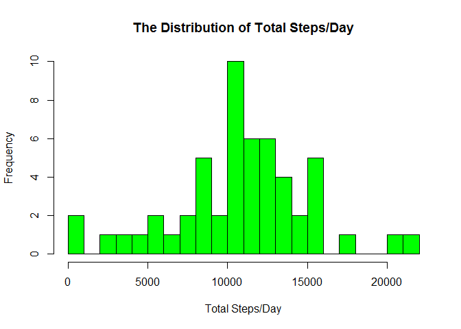
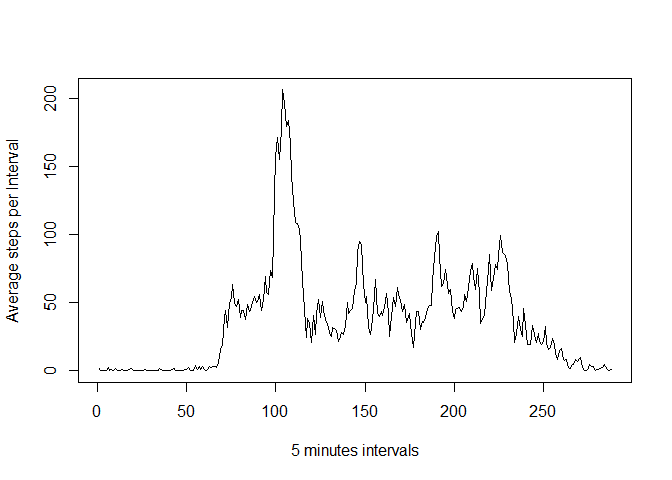

#Reproducible Research : Assignment1 

This assignment makes use of data from a personal activity monitoring device. This device collects data at 5 minute intervals through out the day. The data consists of two months of data from an anonymous individual collected during the months of October and November, 2012 and include the number of steps taken in 5 minute intervals each day.

The data for this assignment can be downloaded from the course web site:

    Dataset: Activity monitoring data [52K]

The variables included in this dataset are:

    steps: Number of steps taking in a 5-minute interval (missing values are coded as NA)
    date: The date on which the measurement was taken in YYYY-MM-DD format
    interval: Identifier for the 5-minute interval in which measurement was taken

The dataset is stored in a comma-separated-value (CSV) file and there are a total of 17,568 observations in this dataset.

##loading library


```r
library(ggplot2)
library(knitr)
```

```
## Warning: package 'knitr' was built under R version 3.2.3
```


#### Reading Data


```r
##Assuming the raw dataset(.zip) downloaded into the working directory
unzip("repdata_data_activity.zip", overwrite = T)

##Reading data
datasource <- read.csv ('activity.csv', header = TRUE, sep = ",",
                colClasses=c("numeric", "character", "numeric"))
```


#### Preprocessing - Formating date(as date) and interval (as factor)


```r
datasource$date <- as.Date(datasource$date, format = "%Y-%m-%d")
datasource$interval <- as.factor(datasource$interval)
```

#### Accumulating total step/day and creating day vs step_perday table


```r
steps_perday <- aggregate(steps ~ date, datasource, sum)
colnames(steps_perday) <- c("date","steps")
head(steps_perday)
```

```
##         date steps
## 1 2012-10-02   126
## 2 2012-10-03 11352
## 3 2012-10-04 12116
## 4 2012-10-05 13294
## 5 2012-10-06 15420
## 6 2012-10-07 11015
```


#### Drawing Histogram for total steps/day

```r
hist(x=steps_perday$steps ,col="green",breaks=20,xlab="Total Steps/Day",
     ylab="Frequency",
     main="The Distribution of Total Steps/Day")
```

<!-- -->

####MEan and Median


```r
##CALCULATING mean
mean (steps_perday$steps, na.rm=TRUE)
```

```
## [1] 10766.19
```

```r
##CALCULATING median
median(steps_perday$steps, na.rm=TRUE)
```

```
## [1] 10765
```

####PATTERN AVERAGE PER INTERVAL , use integer to ensure smooth time series plot

```r
steps_per_interval <- aggregate(list(steps=datasource$steps),   by=list(interval=as.integer(datasource$interval)), FUN=mean,na.rm=TRUE)
head(steps_per_interval)
```

```
##   interval     steps
## 1        1 1.7169811
## 2        2 0.3396226
## 3        3 0.1320755
## 4        4 0.1509434
## 5        5 0.0754717
## 6        6 2.0943396
```

####Plotting Timeseries for PAttern


```r
plot(steps_per_interval$interval, 
     steps_per_interval$steps,
     xlab="5 minutes intervals", ylab="Average steps per Interval",type="l")
```

<!-- -->
####Maximum Steps

```r
maximum_steps <- max(steps_per_interval$steps)
max_interval <- steps_per_interval[steps_per_interval$steps==maximum_steps,]
max_interval
```

```
##     interval    steps
## 104      104 206.1698
```
